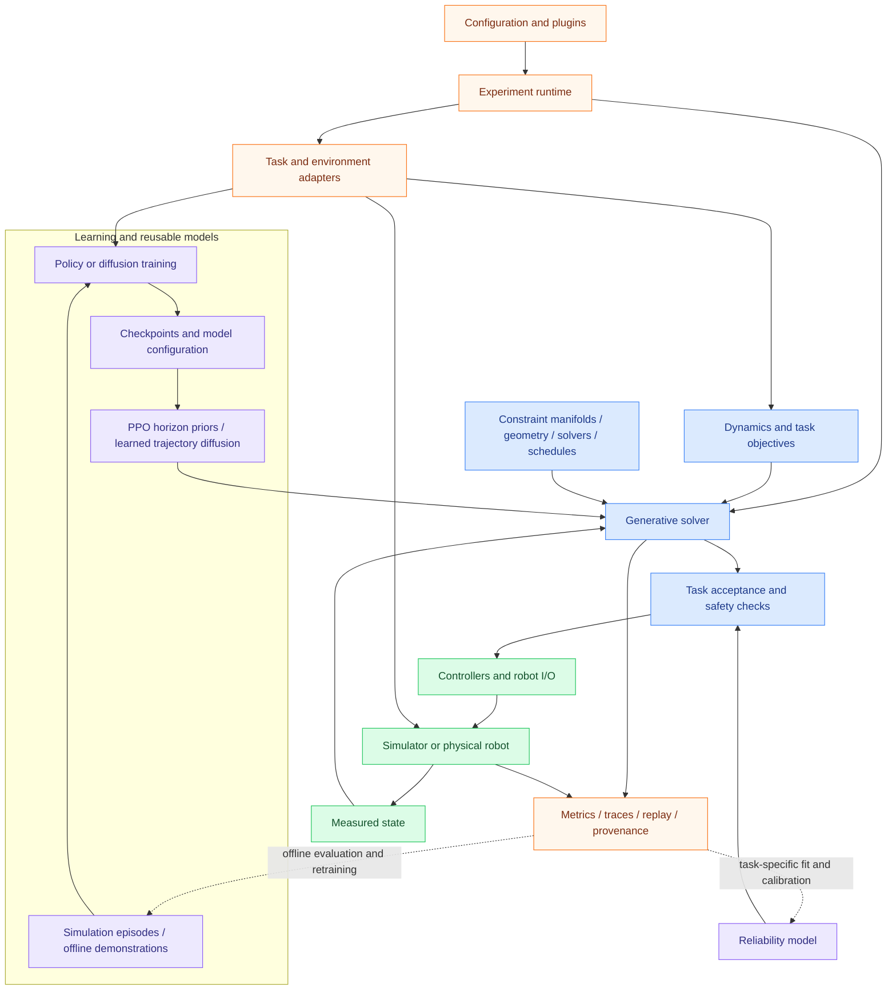

# Architecture

GenerativeDynamics implements **generative dynamics on manifold** for robotics
planning, control and learning through replaceable components. Define a task,
compose planners, constraints and learned models, then run through the direct
Python API or experiment framework. Explicit adapters connect selected plans
to the separate deployment runtime. Learned policies and trajectory models supply
proposals; model-based objectives and constraints shape online generation;
controllers execute the selected result and return the next measured state.

Each task selects the paths it needs. MGA combines PPO proposals with online
model-based generative optimization; DPCC and SafeDiffuser sample learned
trajectory diffusion models. Model-based diffusion also runs without learned
weights. The dotted feedback paths describe explicit offline workflows, rather
than automatic learning during robot execution. See
[learning and priors](/docs/learning-and-priors) for runnable entries.

## Constraints follow the sample batch

A generative planner maintains candidate trajectories, not just one final
plan. Supported JAX paths map rollout and correction kernels across candidates
with `vmap`, while state-dependent time propagation uses `scan`. Feasibility
weights, CBF/CFS corrections and manifold geometry feed subsequent updates.
2GO limits projection work through probes; MGA can evaluate learned horizon
proposals alongside the model-based search. Learned trajectory diffusion has
its own denoising and constraint integration path. See
[batched constraints and generative samples](/docs/batched-constraints)
for the exact per-method order, shapes and numerical-backend boundaries.

## Ownership boundaries

### Configuration owns the protocol

`ExperimentConfig` owns method/environment selection, seeds, suites, device,
metrics, visualization, and output identity. Relative `base:` chains merge
dictionaries recursively and replace scalar/list values deterministically.

### Plugins adapt components

Plugins translate a stable runner interface into solver-, environment-, or
task-specific calls. They keep conditional logic out of the runner and give
registrations explicit names that YAML can reference.

### Solvers own planning mathematics

Solvers own generative inference and online optimization over dynamics,
objectives, constraints, random keys and schedule parameters. They can consume
learned priors without taking ownership of training. They do not choose result
paths, render figures, or aggregate multi-seed experiments.

### Learning owns models and their training contracts

Training entries own policy/diffusion fitting, datasets or training domains,
normalization and checkpoint configuration. Shared prior interfaces expose
actions, control-horizon proposals and optional scores to consumers. PPO
checkpoints can serve standalone inference and MGA horizon proposals; SAC
currently serves standalone policies. DPCC has a dedicated Torch diffusion
training/loading path. Task-specific reliability fitting and calibration stay
separate from online candidate evaluation.

The small JAX learned-diffusion prior is an extension component; the published
MGA recipes do not automatically train it or inject its score into transport.

### Environments own state and execution semantics

Environment plugins create model environments and, where required, distinct
execution environments. Contact tasks can keep structured simulator state and
provide task-owned reset, position extraction, recovery, and reliability
contracts.

### The runner owns evidence

The runner validates configuration, expands suite/seed matrices, persists
success and failure state, invokes metrics and visualizations, and aggregates
numeric results. A failed matrix entry remains visible rather than appearing as
a successful partial run.

### Deployment is a separate runtime

Deployment composes robot I/O, controllers, tasks, safety filters, observers,
and localization through registries. Planning outputs cross into deployment
through explicit adapters and saved artifacts instead of simulator internals.
Measured state closes the execution/replanning loop. Saved traces can support
later learning and calibration, with the selected checkpoint and task contract
recorded for the next run.

## Why this is an industrial architecture

The framework makes replaceability and evidence first-class. A policy prior
can be reused without folding training into a solver; a planner can be changed
without creating a new result format; a simulator can be changed without
rewriting method selection. A benchmark identifies its config, device and
checkpoint provenance, and an incomplete run records its failure. These
boundaries turn paper algorithms into maintainable application components.

## Backend boundary

V1 solver implementations target JAX. NumPy supports utilities and adapters.
Torch supports a runtime adapter and specialized learned planners, but is not a
general replacement for JAX solvers. Rust and C++ require the same tensor,
randomness, compilation, device, and serialization contracts before they can
be advertised as backends.
