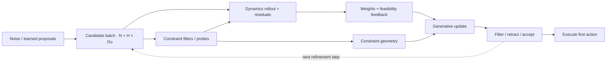

# Batched constraints and generative samples

Constraints help determine **which trajectories the generative process produces**.
They can correct samples, change their importance weights, shape an update on a
constraint manifold, or reject a final proposal before execution. A learned
proposal still passes through the model and constraint checks enabled by its
planner and task.

## Follow a candidate batch

The notation below describes one planning call. `N` is the candidate count,
`H` the rollout horizon, `Du` the action dimension, and `Dx` the state dimension.
`K` denotes generative refinement steps; it is a separate axis from time.

| Object | Typical shape | What happens to it |
| --- | --- | --- |
| Current plan | `(H, Du)` | Center of the next candidate distribution. |
| Candidate actions | `(N, H, Du)` | Noise proposals or learned horizons enter the search. |
| Rollout states | `(N, H + 1, Dx)` | Each trajectory starts from the current observed state. |
| Constraint residuals | Conceptually `(N, H, Nc)` | Task-specific violations are reduced into scores and feedback; implementations need not materialize this whole tensor. |
| Candidate scores and weights | `(N,)` | Task reward and feasibility determine each candidate's contribution. |
| Refined plan | `(H, Du)` | The weighted update can be filtered or retracted again. |



This is a composition map; the planner determines the exact order and which
operations are active. The implementations below do not all filter every sample.

## Where the parallelism lives

**Across candidates:** JAX paths use `vmap` to apply rollout, geometry or
projection kernels to independent trajectories. This is the `N` axis.

**Along a trajectory:** state-dependent filters must propagate the corrected
state. CBF implementations use `lax.scan` over `H`: filter `u[t]`, step the
dynamics with that corrected action, then evaluate the next state. These time
steps cannot generally be treated as independent QPs.

**Across refinement steps:** the generative update depends on the previous
plan. The JAX MDOC, MD-COAS and MGA refinement paths, and 2GO's enabled scan
core, use a separate `lax.scan` over the diffusion/refinement axis.
`plan_batch()` can add an outer axis for modes or seeds; it is distinct from
the candidate batch inside one plan.

Full-horizon CFS changes the coupling within a trajectory: it solves or
approximately projects an action sequence, rather than treating every action
independently. For single-integrator-style dynamics, cumulative action sums
let the JAX path apply coupled constraints without constructing a dense
`(H * Nc, H * Du)` matrix. Top-K selection and masked inactive rows keep
constraint arrays compatible with compiled shapes.

## How each planner uses the batch

| Planner | How constraints enter generative inference |
| --- | --- |
| **MDOC** | Every reverse step calls `apply_actions_batch()` on sampled actions. The filtered trajectories are rolled out and weighted; the updated mean is filtered again. CBF filters use candidate `vmap` around a stateful horizon `scan`. |
| **MD-COAS** (`cfsmbd` in configuration) | CFS corrects per-step or full-horizon actions when its schedule enables projection. Rollout reward includes augmented-Lagrangian feasibility terms. The adaptive path measures unfiltered samples for violation feedback and scores filtered samples for the generative update. |
| **2GO** | Rollouts evaluate the candidate batch. A budgeted probe selects high-violation and random candidates, gathers them, maps a CFS retraction over the probe slots, and scatters corrections back. Probe displacement refines constraint geometry, which shapes the generative direction and noise. The updated proposal can be retracted again. |
| **MGA** | Search operates on `(B, Hnode + 1, Du)` control nodes, expanded to dense actions by a spline. Guided modes mix learned horizon proposals into the refinement batch; additive mode preserves the Gaussian search and separately compares learned candidates. Model rollouts score task residuals. Manifold projection shapes the node update, clean-manifold retraction corrects the final proposal, and enabled acceptance hooks compare risk and fallback candidates. A task can additionally enable an action filter. |

For MGA, `B` need not equal `Nsample`: an incumbent or explicit prior candidate
can be appended. Guided structured proposals share the configured refinement
budget, whereas additive priors have a separate candidate budget. See
[Learning and priors](/docs/learning-and-priors) for checkpoints and prior modes.

2GO's active probe count is also not a promise of exactly that many independent
native QP calls: the compiled probe has a fixed maximum slot count and masks
inactive slots. Projection effort, probe capacity and scheduling jointly
determine its cost.

## Learned trajectory diffusion: DPCC and SafeDiffuser

These integrations use a **trained Torch denoising model**, rather than the
JAX model-based refinement paths above. Each denoising sample has shape
`(B, H, transition_dim)`: action channels come first, followed by observation
channels and any model-specific goal channels. Conditions pin observations
such as the current state or goal. After sampling, policy wrappers split and
unnormalize the action and observation slices.

| Integration | Where constraints modify the learned samples | Actual batch execution |
| --- | --- | --- |
| **DPCC projection variant** | After a denoising step and conditioning, the enabled projector corrects the sampled trajectory when the diffusion timestep is below its configured threshold. Goal-only tail channels are excluded from projection, and conditions are reapplied afterward. Gradient variants instead add a constraint gradient to the model mean. | The current `Projector.project()` flattens each horizon, transfers tensors to CPU NumPy, loops over `B` candidates using SciPy SLSQP, and restores a Torch batch on the model device. Torch model inference is batched; this projector is a host-side trajectory solve. |
| **SafeDiffuser** | Each denoising step calls `invariance(previous_sample, proposed_sample)` when safety is enabled. Its CBF-QP corrects selected observation XY channels in the proposed sample; it leaves the action slice unchanged. Conditioned endpoints are skipped. | The corrector flattens `B × selected_time_slots` into `BT` independent 2D position-increment QPs, builds Torch tensors `Q[BT,2,2]`, `G[BT,Nc,2]`, `h[BT,Nc]`, and calls batched `qpth.QPFunction`. It writes corrected positions back before reapplying conditions. |

SafeDiffuser's QPs constrain the **denoising update** at each selected slot;
they do not enforce dynamics consistency between successive horizon states.
Its D3IL integration can additionally repair actions and apply the framework
constraint pipeline after sampling. Those task-specific operations include
host-side loops and must be measured separately from denoising throughput.
The invariance corrector falls back to the proposed increment if its QP raises
an exception, so evaluate the resulting trajectory rather than interpreting
an enabled flag as a feasibility certificate.

These are specialized Torch integrations. They do not establish Torch parity
for the shared JAX planner, geometry or constraint stack. See
[Learning and priors](/docs/learning-and-priors#learned-trajectory-diffusion)
for training and checkpoint setup.

## Pick a numerical path that fits the loop

| Path | Inside a compiled JAX candidate loop? | Numerical behavior |
| --- | --- | --- |
| Existing JAX CBF / CFS filters | Yes, for their supported task integrations. | Closed-form halfspace corrections or iterative JAX projections, with per-step or full-horizon coupling. |
| `solve_hard_qp_jax()` / `solve_slack_qp_jax()` | Yes; callers can compose `jit`, `vmap` and JAX loops. | Finite, projection-style updates. They are not general exact QP solvers. |
| `JAXOPTOsqpSolver.solve_qp()` | The current public wrapper is host-facing. | Runs `jaxopt.OSQP` internally, then converts its result to NumPy. Calling this wrapper inside `vmap` is not the same as using a pure-JAX kernel. |
| `OSQPSolver` / `CVXOPTSolver` | No native JAX batch path in these wrappers. | CPU Python/NumPy QP interfaces. A batch requires explicit host orchestration; existing NumPy filter paths loop over trajectories. |

Thus, “batched constraints” means that candidate generation, constraint
evaluation and supported correction kernels compose over a batch. It does
not mean that every backend solves all QPs in one native batch invocation.
Use the [solver catalogue](/docs/constraints) and
[compatibility matrix](/docs/compatibility) when selecting a recipe.

## Try a small batch kernel

This example applies an existing JAX projection helper to `64 × 20` independent
actions. Its fixed halfspaces are `u[0] >= 0.2` and `u[1] >= -0.1`, with action
bounds `[-1, 1]`. It demonstrates array composition; it does not model dynamics
or replace a state-dependent CBF/CFS trajectory filter.

```python
import jax
import jax.numpy as jnp
from genedynamics.core.constraints.solvers.jaxopt_osqp_solver import solve_hard_qp_jax

N, H, D = 64, 20, 2
samples = jax.random.normal(jax.random.PRNGKey(0), (N, H, D))
A = jnp.eye(D, dtype=jnp.float32)
b = jnp.array([0.2, -0.1], dtype=jnp.float32)

def project_action(u):
    return solve_hard_qp_jax(u, A, b, control_limit=1.0, maxiter=20)

project_batch = jax.jit(jax.vmap(jax.vmap(project_action)))
filtered, residual = project_batch(samples)
filtered.block_until_ready()
assert filtered.shape == (N, H, D)
assert residual.shape == (N, H)
assert float(residual.max()) < 1e-6
```

For robot tasks, begin with an existing
[MDOC, MD-COAS, 2GO or MGA recipe](/docs/recipes). Keep the task's dynamics,
constraint residuals and action semantics together. Re-evaluate the resulting
trajectory after correction: clipping, slack, local linearization and iteration
limits can leave residual violations. Compare violation statistics and
projection effort alongside warm-run planning latency; increasing `Nsample`
alone does not establish feasibility or a control-rate guarantee.

## Implementation map

- [Filter contract and batch hook](https://github.com/hhhhzl/genedynamics/blob/release/v1-open-source/genedynamics/core/constraints/action_filters/base.py)
- [MDOC sample → filter → weight loop](https://github.com/hhhhzl/genedynamics/blob/release/v1-open-source/genedynamics/solvers/single/mdoc/backends/mdoc_jax.py)
- [CBF candidate vmap and horizon scan](https://github.com/hhhhzl/genedynamics/blob/release/v1-open-source/genedynamics/core/constraints/action_filters/cbf_closed_form.py)
- [MD-COAS augmented scoring and adaptive feedback](https://github.com/hhhhzl/genedynamics/blob/release/v1-open-source/genedynamics/solvers/single/cfsmbd/backends/cfsmbd_jax.py)
- [Full-horizon CFS projection](https://github.com/hhhhzl/genedynamics/blob/release/v1-open-source/genedynamics/core/constraints/action_filters/cfs_qp_full.py)
- [2GO probe gather → vmap → scatter](https://github.com/hhhhzl/genedynamics/blob/release/v1-open-source/genedynamics/genemetry/pipeline/backends/probe_jax.py)
- [MGA node proposals, rollout and acceptance](https://github.com/hhhhzl/genedynamics/blob/release/v1-open-source/genedynamics/solvers/single/mga/backends/mga_jax.py)
- [MGA clean-manifold retraction](https://github.com/hhhhzl/genedynamics/blob/release/v1-open-source/genedynamics/solvers/single/mga/core/retraction.py)
- [DPCC denoising and projection schedule](https://github.com/hhhhzl/genedynamics/blob/release/v1-open-source/genedynamics/solvers/single/dpcc/stepper.py)
- [DPCC host-side trajectory projector](https://github.com/hhhhzl/genedynamics/blob/release/v1-open-source/genedynamics/solvers/single/dpcc/patch/projector.py)
- [SafeDiffuser denoising stepper](https://github.com/hhhhzl/genedynamics/blob/release/v1-open-source/genedynamics/solvers/single/safediffuser/stepper.py)
- [SafeDiffuser batched CBF-QP corrector](https://github.com/hhhhzl/genedynamics/blob/release/v1-open-source/genedynamics/solvers/single/safediffuser/patch/avoiding_cbf_qp.py)
- [SafeDiffuser sample channel layout](https://github.com/hhhhzl/genedynamics/blob/release/v1-open-source/genedynamics/solvers/single/safediffuser/policies.py)
